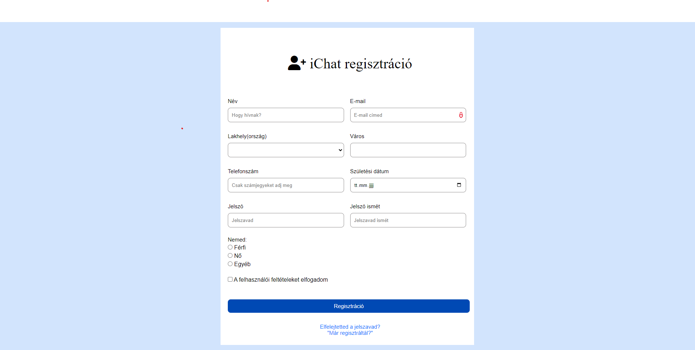

Az elkészítési folyamat:
1. lépésként megnyitottam a feladatot és elindítottam az első részt, amit Visual Studioban készítettem el.

Ez egy regisztrációs felület reszponzív nézettel. Flexboxban készül.
  -elkészítettem az alap input mezőket ,a checkbox részt és a regisztrációs submit gombot
  
  
Css-ben elkezdtem a stilizálást:
-Megadtam az alap paramétereket, ezután a container részeit-nek megadtam a stílus elemeit.
-Középre igazítottam a flexbox-on belül.
-Megformáztam a fő elemeket és az input mezők részeit
-Elkészítettem a nemek listáját
-és a checkbox elemet 
- Megformáztam a submit gombot
- és a végén két a href attributumot középre igazítottam megváltoztattam a színt és kiszedtem az aláhúzást a szöveg alól.
- 
